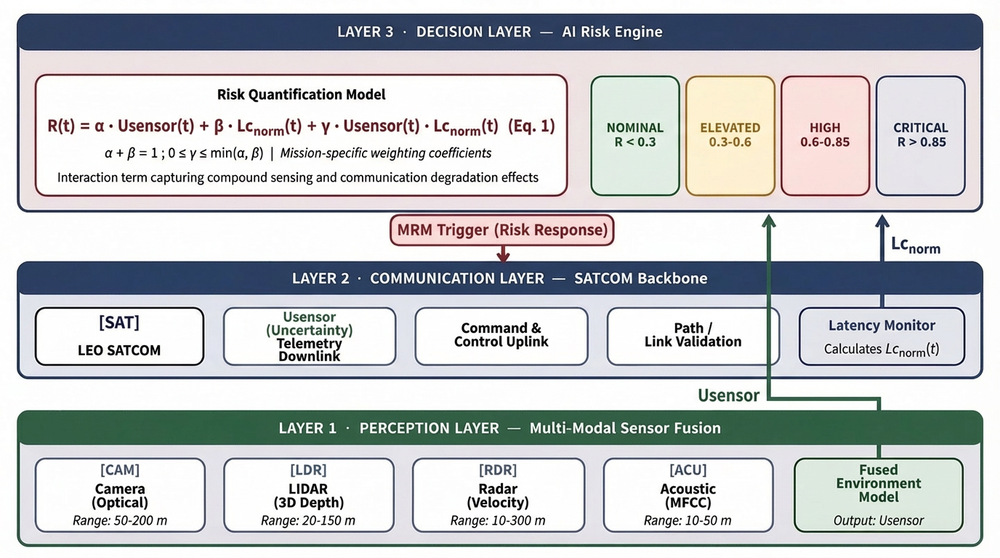
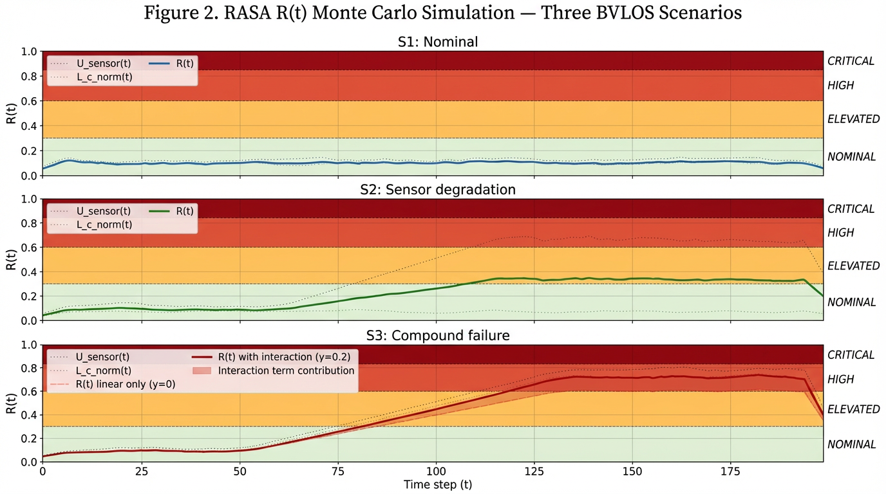
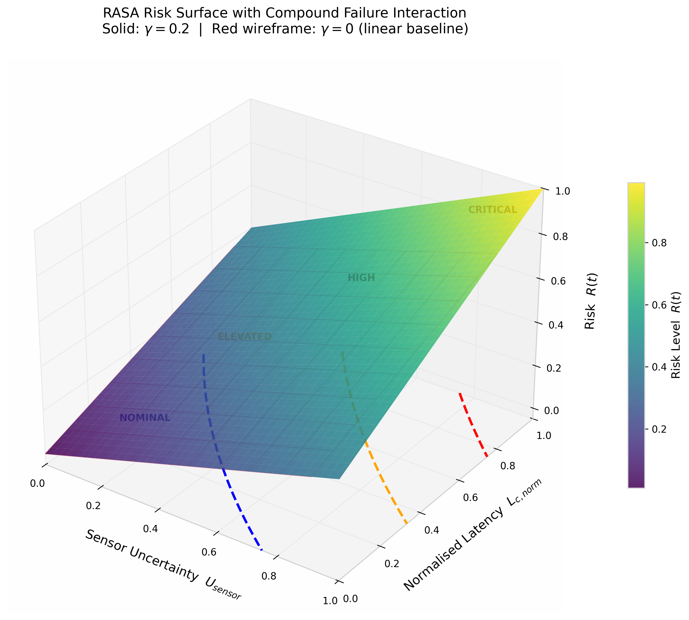

# Risk-Aware AI Architecture for BVLOS UAV Safety (RASA)

> Reproducibility package accompanying the **Risk-Aware AI Architecture for BVLOS UAV Safety (RASA)**, including architectural visualisations, risk-surface analysis, Monte Carlo simulation results, graphical abstract assets, and supporting metadata.

---

## Overview

This repository provides the reproducibility package supporting the Risk-Aware AI Architecture for BVLOS UAV Safety (RASA), a framework designed to quantify operational risk in Beyond Visual Line of Sight (BVLOS) Unmanned Aerial Vehicle (UAV) missions operating over satellite communication (SATCOM) networks.

RASA integrates sensor uncertainty, communication latency, and compound-failure interactions within an explainable, rule-based decision architecture intended to support safety-critical autonomous operations.

---

## Graphical Abstract

---

## Core Risk Model

The RASA framework quantifies operational risk using:

**R(t) = α·U_sensor(t) + β·L_c,norm(t) + γ·U_sensor(t)·L_c,norm(t)**

where:

| Parameter   | Description                                 |
| ----------- | ------------------------------------------- |
| U_sensor(t) | Normalized sensor uncertainty               |
| L_c,norm(t) | Normalized communication latency            |
| α           | Sensor uncertainty weighting coefficient    |
| β           | Communication latency weighting coefficient |
| γ           | Nonlinear interaction coefficient           |

The interaction term captures nonlinear risk escalation when degraded perception and communication latency occur simultaneously.

---

## Three-Layer Architecture

### Layer 1 – Perception Layer

* Multi-modal sensor fusion
* Bayesian uncertainty estimation
* Sensor health monitoring
* Generation of U_sensor(t)

### Layer 2 – Communication Layer

* SATCOM communication monitoring
* Latency measurement
* Latency normalization
* Generation of L_c,norm(t)

### Layer 3 – Decision Layer

* Explainable rule-based AI risk engine
* Risk-state determination
* Safety intervention logic
* Autonomous decision support

---

## Figure 1 – RASA System Architecture

The architecture integrates perception uncertainty and communication latency into a unified operational risk metric for BVLOS UAV missions.

---

## Figure 2 – Risk Surface Analysis

Three-dimensional visualization of operational risk as a function of sensor uncertainty and normalized communication latency.

---

## Figure 3 – Monte Carlo Simulation Results

Monte Carlo simulation results demonstrating nominal, degraded, and compound-failure BVLOS operational scenarios.

---

## Risk State Classification

| Risk State | Risk Score  |
| ---------- | ----------- |
| Nominal    | 0.00 – 0.30 |
| Elevated   | 0.31 – 0.60 |
| High       | 0.61 – 0.85 |
| Critical   | > 0.85      |

---

## Repository Contents

| File                           | Description                   |
| ------------------------------ | ----------------------------- |
| Graphical_Abstract_RASA.png    | Graphical abstract            |
| Figure1_RASA_Architecture.png  | Three-layer RASA architecture |
| Figure2_Risk_Surface.png       | Risk surface visualization    |
| Figure3_MonteCarlo_Results.png | Monte Carlo scenario analysis |
| RASA_Model_Metadata.txt        | Model parameters and metadata |

---

## Reproducibility Materials

This repository contains the figures, metadata, model parameters, and supporting materials used to document and reproduce the Risk-Aware AI Architecture for BVLOS UAV Safety (RASA).

---

## Zenodo Archive

A permanent archived version of this repository is available through Zenodo.

**DOI:** *(Insert Zenodo DOI after publication)*

---

## Citation

If you use this repository, please cite:

Barua, N. (2026). Reproducibility Package for the Risk-Aware AI Architecture for BVLOS UAV Safety (RASA). Zenodo.

---

## License

This repository is distributed under the Apache License 2.0.
