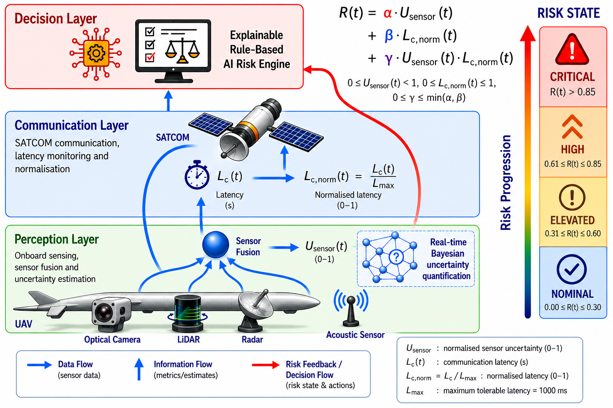

# Risk-Aware UAV Safety Architecture (RASA) for BVLOS Operations

Reproducibility package accompanying the **Risk-Aware UAV Safety Architecture (RASA) for BVLOS Operations**, including architectural visualisations, risk-surface analysis, Monte Carlo simulation results, graphical abstract assets, and supporting metadata.

---

## Overview

This repository provides the reproducibility package supporting the Risk-Aware UAV Safety Architecture (RASA), a framework designed to quantify operational risk in Beyond Visual Line of Sight (BVLOS) Unmanned Aerial Vehicle (UAV) missions operating over satellite communication (SATCOM) networks.

RASA integrates multi-modal sensor fusion, SATCOM-enabled communication monitoring, and formal risk quantification within a unified, auditable safety architecture for BVLOS UAV operations.

---

## Graphical Abstract

---

## Core Risk Model

The RASA framework quantifies operational risk using:

**R(t) = α·U_sensor(t) + β·L_c,norm(t) + γ·U_sensor(t)·L_c,norm(t)**

| Parameter | Description |
|---|---|
| U_sensor(t) | Normalised sensor uncertainty |
| L_c,norm(t) | Normalised communication latency |
| α | Sensor uncertainty weighting coefficient |
| β | Communication latency weighting coefficient |
| γ | Nonlinear interaction coefficient |

The interaction term captures nonlinear risk escalation when degraded perception and communication latency occur simultaneously.

---

## Three-Layer Architecture

**Layer 1 – Perception Layer**
- Multi-modal sensor fusion
- Bayesian uncertainty estimation
- Sensor health monitoring
- Generation of U_sensor(t)

**Layer 2 – Communication Layer**
- SATCOM communication monitoring
- Latency measurement and normalisation
- Generation of L_c,norm(t)

**Layer 3 – Decision Layer**
- Explainable rule-based decision engine
- Risk-state determination
- Safety intervention logic
- Autonomous decision support

---

## Figures

### Figure 1 – RASA System Architecture

The three-layer architecture integrates perception uncertainty and communication latency into a unified operational risk metric for BVLOS UAV missions.

### Figure 2 – Monte Carlo Simulation Results

Monte Carlo simulation results demonstrating nominal, degraded, and compound-failure BVLOS operational scenarios, including γ sensitivity analysis.

### Figure 3 – Risk Surface Analysis

Three-dimensional visualisation of operational risk as a function of sensor uncertainty and normalised communication latency.

### Figure 4 – Compound Failure Escalation

Compound failure escalation scenario illustrating simultaneous sensor degradation and SATCOM latency increase, demonstrating nonlinear risk amplification and escalation through the Minimum Risk Manoeuvre (MRM) hierarchy.

---

## Risk State Classification

| Risk State | Risk Score |
|---|---|
| Nominal | 0.00 – 0.30 |
| Elevated | 0.31 – 0.60 |
| High | 0.61 – 0.85 |
| Critical | > 0.85 |

---

## Repository Contents

| File | Description |
|---|---|
| `Graphical_Abstract_RASA.png` | Graphical abstract |
| `Figure_1_The Risk-Aware UAV Safety Architecture.png` | Three-layer RASA architecture diagram |
| `Figure_2_Monte Carlo simulation.png` | Monte Carlo scenario analysis and γ sensitivity |
| `Figure_3_Risk surface.png` | Risk surface visualisation |
| `Figure_4_Compound failure escalation.png` | Compound failure escalation and MRM hierarchy |
| `RASA_Model_Metadata.txt` | Model parameters and metadata |

---

## Reproducibility Materials

This repository contains the figures, metadata, model parameters, and supporting materials used to document and reproduce the Risk-Aware UAV Safety Architecture (RASA) for BVLOS Operations.

> **Note:** Simulation scripts generating the Monte Carlo results and sensitivity analysis (Table 7 of the accompanying manuscript) are derived from the model parameters documented in `RASA_Model_Metadata.txt`. Full parameterisation is provided therein to enable independent reproduction.

---

## Zenodo Archive

A permanent archived version of this repository is available through Zenodo.

**DOI: 10.5281/zenodo.20692686**

---

## Citation

If you use this repository, please cite:

> Barua, N. (2026). Reproducibility Package for the Risk-Aware UAV Safety Architecture (RASA) for BVLOS Operations. Zenodo. https://doi.org/10.5281/zenodo.20692686

---

## License

This repository is distributed under the [Apache License 2.0](LICENSE).
